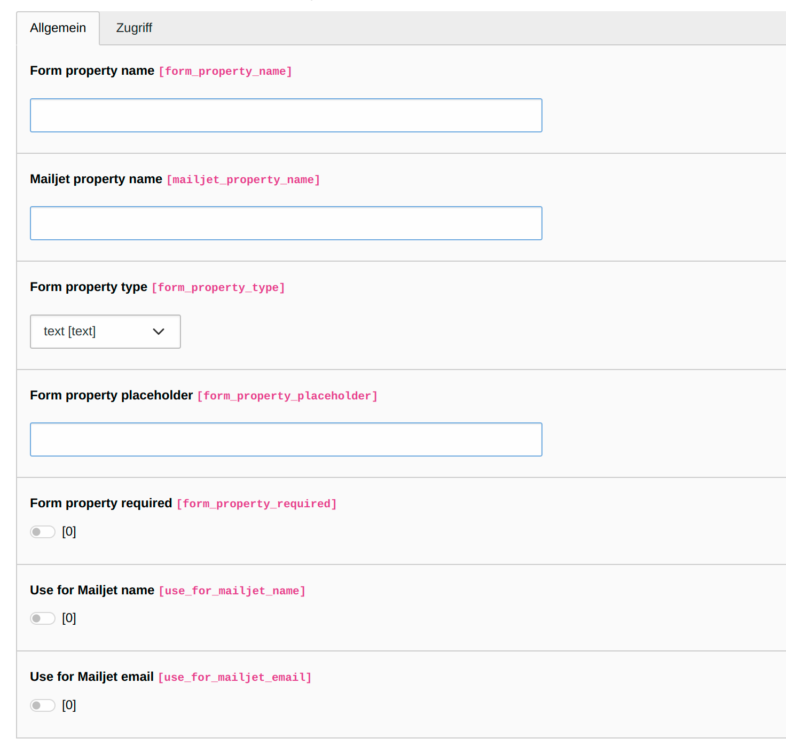
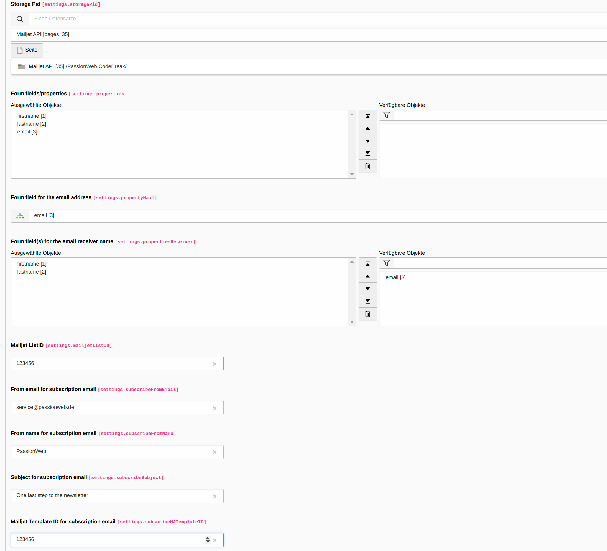

.. include:: ../Includes.txt

Editors Manual
=====================

Target group: **Editors**

How editors should use the extension
^^^^^^^^^^^^^^^^^^^^^^^^^^^^^^^^^^

.. _add-your-required-properties:

Add your required properties
---------------------------------

The properties are used to define the fields for the subscription form and the associated mapping to the Mailjet fields. The following fields are available:

1. Form property name: The name of the property in the subcription form
2. Mailjet property name: The name of the (contact) property in Mailjet
3. Form property type: Select the type of the field in the subscription form (possible values: text, email, tel, number, url)
4. Form field placeholder: The placeholder text for the field in the subscription form
5. Form field required: Select if the current field is required in the subscription form or not (default: false)
6. Use for Mailjet name: Select if the current field should be used for the name in your Mailjet subscription and verification email (default: false)
7. Use for Mailjet email: Select if the current field should be used for the email in your Mailjet subscription and verification email (default: false)

.. _add-and-configure-plugin-mail-subscription-form:

Add and configure plugin "Mail subscription form"
-------------------------------------------------

1. Add the plugin "Mailjet subscription form" to your selected page
2. Configure the plugin settings:

   - Storage Pid: select the storage where subscription records should be stored
   - Form fields/properties: Select all properties you want to use in your subscription form
   - Form field for the email address: Select the property you want to use for the email address in your subscription email
   - Form field(s) for the email receiver name: Select the property or properties you want to use for the receiver name in your subscription email
   - Mailjet ListID: Enter the ID of the Mailjet list you want to use for the subscription
   - From email for subscription email: Enter the email you want to use as the sender of your subscription email
   - From name for subscription email: Enter the name you want to use as the sender of your subscription email
   - Subject for subscription email: Enter the subject you want to use for your subscription email
   - Mailjet TemplateID for subscription email: Enter the ID of the Mailjet template you want to use for the subscription email
   - Redirect to page after form submit: select the page where users should be redirected after submitting the subscription form

.. _add-and-configure-plugin-mail-verify-subcription:

Add and configure plugin "Mail verify subscription"
---------------------------------------------------

1. Add the plugin "Mailjet verify subscription" to your selected page (should be different than the page with the subscription form)
2. Configure the plugin settings:

   - Mailjet ListID: Enter the ID of the Mailjet list you want to use for the verification (must be the same as in the plugin "Mail subscription form")
   - From email for verification email: Enter the email you want to use as the sender of your verification email
   - From name for verification email: Enter the name you want to use as the sender of your verification email
   - Subject for verification email: Enter the subject you want to use for your verification email
   - Mailjet TemplateID for verification email: Enter the ID of the Mailjet template you want to use for the verification email

