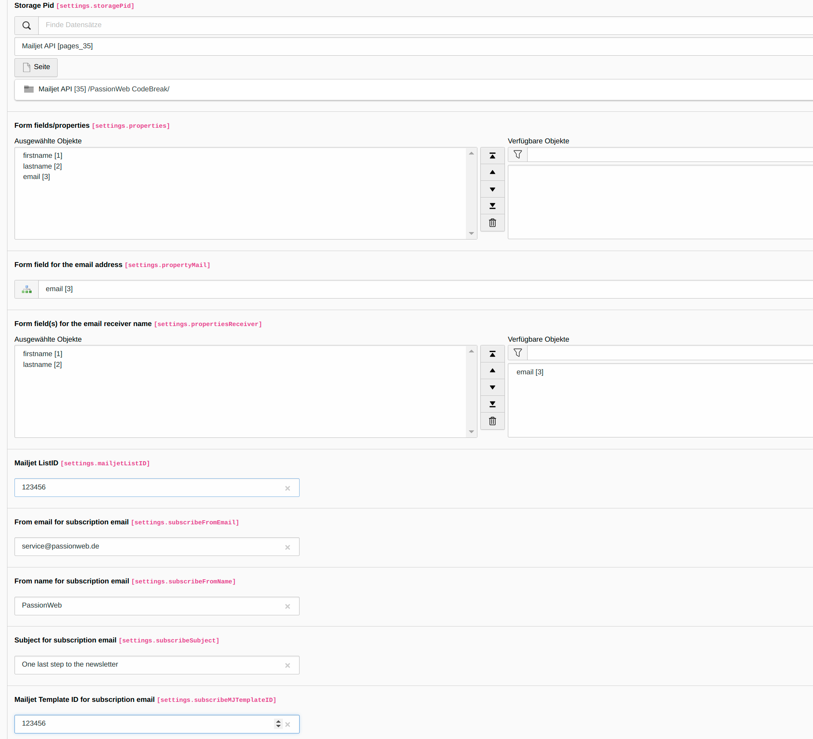

# Mailjet API extension for TYPO3

## What does it do?

This extension uses the Mailjet API so users can subscribe to your newsletter(s) and be added to your Mailjet mailing list(s). It comes with two plugins. One with the mailjet subscription form and one with the mailjet verification form.

You can customize the subscription form to your individual (Mailjet) needs. You can choose which fields should be displayed and how they are mapped to the corresponding contact fields in Mailjet, which field(s) should be used for the receiver name and which field should be used for the email.

## Requirements

- TYPO3 >= 11.5.0
- PHP >= 7.4
- Mailjet API key and secret key

## Installation

    composer require "passionweb/mailjet-api"

- Install the extension via composer
- Add the necessary RouteEnhancer (see #necessary-routeenhancer)
- Add your Mailjet API key and secret key to the extension configuration before using the extension
- Flush TYPO3 and PHP Cache

## Configuration

### Necessary RouteEnhancer

- Add the following RouteEnhancer to the section `routeEnhancers` in your site configuration (`config.yaml`):

```yaml
    MailjetDoubleOptIn:
        type: Simple
        limitToPages: [ YOUR_PID ]
        routePath: '/{contact_id}'
        requirements:
            contact_id: '[0-9]{1,10}'
        _arguments: {}
```

### Frontend configuration "enforceValidation" and "excludedParameters" (TYPO3 v12)

You need to add the `contact_id` parameter to the `excludedParameters` if you don't use the `limitToPages` option of the RouteEnhancer and if it should be possible to call the same page (where your mailjet verification plugin is included) with the contact_id as an argument and without the contact_id.


    $GLOBALS['TYPO3_CONF_VARS']['FE']['cacheHash'] = [
        'enforceValidation' => true,
        'excludedParameters' => [
            'contact_id',
        ],
    ];


### Extension configuration

There are the following extension settings available.

    # cat=Mailjet settings; type=string; label=Mailjet API key;
    mailjetApiKey= YOUR_MAILJET_API_KEY

Enter your Mailjet API key.

    # cat=Mailjet settings; type=string; label=Mailjet secret key;
    mailjetSecretKey= YOUR_MAILJET_SECRET_KEY

Enter your Mailjet secret key.

    # cat=Mailjet settings; type=string;  label=Mailjet API version
    mailjetApiVersion = v3

Enter the current Mailjet API version.

## How editors should use the extension

### Add your required properties

The properties are used to define the fields for the subscription form and the associated mapping to the Mailjet fields. The following fields are available:

1. Form property name: The name of the property in the subscription form
2. Mailjet property name: The name of the (contact) property in Mailjet
3. Form property type: Select the type of the field in the subscription form (possible values: text, email, tel, number, url)
4. Form field placeholder: The placeholder text for the field in the subscription form
5. Form field required: Select if the current field is required in the subscription form or not (default: false)
6. Use for Mailjet name: Select if the current field should be used for the name in your Mailjet subscription and verification email (default: false)
7. Use for Mailjet email: Select if the current field should be used for the email in your Mailjet subscription and verification email (default: false)


### Add and configure plugin "Mail subscription form"

1. Add the plugin "Mailjet subscription form" to your selected page
2. Configure the plugin settings:

    - Storage Pid: select the storage where subscription records should be stored
    - Form fields/properties: Select all properties you want to use in your subscription form
    - Form field for the email address: Select the property you want to use for the email address in your subscription email
    - Form field(s) for the email receiver name: Select the property or properties you want to use for the receiver name in your subscription email
    - Mailjet ListID: Enter the ID of the Mailjet list you want to use for the subscription
    - From email for subscription email: Enter the email you want to use as the sender of your subscription email
    - From name for subscription email: Enter the name you want to use as the sender of your subscription email
    - Subject for subscription email: Enter the subject you want to use for your subscription email
    - Mailjet TemplateID for subscription email: Enter the ID of the Mailjet template you want to use for the subscription email
    - Redirect to page after form submit: select the page where users should be redirected after submitting the subscription form



### Add and configure plugin "Mail verify subscription"

1. Add the plugin "Mailjet verify subscription" to your selected page (should be different from the page with the subscription form)
2. Configure the plugin settings:

    - Mailjet ListID: Enter the ID of the Mailjet list you want to use for the verification (must be the same as in the plugin "Mail subscription form")
    - From email for verification email: Enter the email you want to use as the sender of your verification email
    - From name for verification email: Enter the name you want to use as the sender of your verification email
    - Subject for verification email: Enter the subject you want to use for your verification email
    - Mailjet TemplateID for verification email: Enter the ID of the Mailjet template you want to use for the verification email


## Important notes

The extension uses the external service Mailjet. To use the extension, you need a Mailjet account and an API key For more information visit the [Mailjet website](https://www.mailjet.com/ "Mailjet Website").

## Troubleshooting and logging

If something does not work as expected take a look at the log file first.
Every problem is logged to the TYPO3 log (normally found in `var/log/typo3_*.log`)

## Achieving more together or Feedback, Feedback, Feedback

I'm grateful for any feedback! Be it suggestions for improvement, extension requests or just a (constructive) feedback on how good or crappy the extension is.

Feel free to send me your feedback to [service@passionweb.de](mailto:service@passionweb.de "Send Feedback") or [contact me on Slack](https://typo3.slack.com/team/U02FG49J4TG "Contact me on Slack")

